# [github.com/sneat-co/sneat-apps](https://github.com/sneat-co/sneat-apps)

A suit of open source apps that help in work & personal life.

---

## [](https://github.com/sneat-co/sneat-apps/actions/workflows/build-nx.yml)

## Apps for family & personal life

- [**Sneat.app**](https://sneat.app) - a "super" neat family app that saves you time & money.
  - Members
  - Schedule / calendar
  - Contacts
  - Assets management (_details, log book, renewal reminders, etc._)
  - Budgeting (_integrated with assets management_)
  - Lists: ToDo, ToBuy, ToWatch, etc.
  - etc.

[//]: # '## Apps for work'
[//]: # '- **Sneat.team** - provides authentication & org structure for below apps:'
[//]: # '    - [DataTug](src/apps/datatug) - SQL & HTTP queries workbench'
[//]: # '    - [ScrumSpace](src/apps/scrumspace) - daily scrums & retrospectives for agile teams '
[//]: # '    - [IssueNumber.One](src/apps/issuenumberone) - facilitates continuous **focused** feedback & improvements'

## Architecture Overview

### High-Level System Architecture

```mermaid
graph TB
    subgraph "User Interfaces"
        WebApp["🌐 Web Application<br/>(Progressive Web App)"]
        iOS["📱 iOS App<br/>(Capacitor)"]
        Android["🤖 Android App<br/>(Capacitor)"]
    end

    subgraph "Frontend Layer - Nx Monorepo"
        SneatApp["Sneat.app<br/>(Angular + Ionic)"]
        DataTug["DataTug<br/>(SQL Workbench)"]
        Logist["Logist<br/>(Logistics)"]

        subgraph "Shared Libraries"
            Auth["@sneat/auth"]
            Space["@sneat/space"]
            UI["@sneat/ui"]
            Core["@sneat/core"]
        end

        subgraph "Extensions"
            Assetus["assetus<br/>(Assets)"]
            Budgetus["budgetus<br/>(Budget)"]
            Schedulus["schedulus<br/>(Calendar)"]
            Contactus["contactus<br/>(Contacts)"]
            Listus["listus<br/>(Lists)"]
        end
    end

    subgraph "Backend Services"
        Firebase["🔥 Firebase"]
        Firestore["Firestore<br/>(Database)"]
        FireAuth["Firebase Auth"]
        Analytics["Analytics"]
        Storage["Cloud Storage"]
    end

    WebApp --> SneatApp
    iOS --> SneatApp
    Android --> SneatApp

    SneatApp --> Auth
    SneatApp --> Space
    SneatApp --> Extensions
    DataTug --> Core
    Logist --> Core

    Auth --> FireAuth
    Space --> Firestore
    Extensions --> Firestore
    Core --> Firebase

    Firebase --> Firestore
    Firebase --> FireAuth
    Firebase --> Analytics
    Firebase --> Storage

    style SneatApp fill:#4CAF50
    style Extensions fill:#2196F3
    style Firebase fill:#FF9800
```



### Extension Module System


### Data Flow Architecture


## Tech stack

- [Angular](https://angular.io/) - the modern web developer's platform
- [Capacitor](https://capacitorjs.com/) - a cross-platform native runtime for web/hybrid apps.
- [Ionic Framework](https://ionicframework.com/) - an open source mobile UI toolkit for building high quality,
- [TypeScript](https://www.typescriptlang.org/) - typed JavaScript at any scale
  cross-platform native and web app experiences.
- [nx](https://nx.dev/) by [Nrwl](https://nrwl.io/) - extensible dev tools for monorepos

## Setting up development environment

If you want to contribute to this open source project you can
read instructions on how to set up local dev environment in [README-DEV-SETUP.md](docs/README-DEV-SETUP.md).

## Testing

This repository includes comprehensive test templates and documentation for writing consistent tests:

- 📖 [Testing Guide](docs/TESTING.md) - Comprehensive guide to testing patterns, best practices, and running tests
- 💡 [Testing Examples](docs/TESTING-EXAMPLES.md) - Practical examples of generating and using test templates
- 🛠️ [Test Templates](templates/) - Reusable templates for services, components, and sanity tests

**Quick start:**

```bash
# Generate a test using templates
node scripts/generate-extension-test.mjs service YourService extension-name shared services

# Run tests
pnpm nx test <project-name>
```

## AI Agent Improvement Plan

We've analyzed the codebase and created a prioritized list of **Top 10 high-ROI improvements** for AI agents:

**👉 [START HERE: AI Improvement Index](docs/AI-IMPROVEMENT-INDEX.md)** ⭐

Detailed documentation:

- 📋 [Quick Summary](docs/AI-TASKS-SUMMARY.md) - 10 tasks at a glance (5 min read)
- 📚 [Full Plan](docs/AI-IMPROVEMENT-PLAN.md) - Detailed guide with step-by-step instructions (20 min read)
- 🎨 [Visual Roadmap](docs/AI-IMPROVEMENT-VISUAL.md) - ASCII art timeline (3 min browse)

**Quick wins** (Week 1, 16h): Re-enable CI tests, add coverage baseline, optimize bundle size, pre-commit hooks, Docker setup.

## Promoted discussions

- [Best tag-line for Sneat.app?](https://github.com/sneat-co/sneat-apps/discussions/1568)

## Signed commits

Test signed commits 3.

## Follow us on Telegram

If you want to know insights about deveopment of Sneat apps follow [@SneatDevDiaries](https://t.me/SneatDevDiaries)
