# Sneat Apps Architecture

This document describes the architecture of the Sneat applications ecosystem, including the technology stack, system components, module organization, and data flow patterns.

---

## Table of Contents

- [Overview](#overview)
- [Technology Stack](#technology-stack)
- [System Architecture](#system-architecture)
- [Frontend Architecture](#frontend-architecture)
  - [Monorepo Structure](#monorepo-structure)
  - [Applications](#applications)
  - [Core Libraries](#core-libraries)
  - [Extension Modules](#extension-modules)
- [Backend Architecture](#backend-architecture)
- [Data Flow & State Management](#data-flow--state-management)
- [Authentication & Security](#authentication--security)
- [Mobile Applications](#mobile-applications)
- [Development Workflow](#development-workflow)
- [Deployment Architecture](#deployment-architecture)

---

## Overview

Sneat apps is a suite of open source applications that help in work and personal life. The flagship application is [Sneat.app](https://sneat.app), a comprehensive family and personal management tool that provides features for members, scheduling, contacts, assets, budgeting, and various list management.

The architecture follows a modular design pattern with:

- **Nx monorepo** for code organization and tooling
- **Extension-based architecture** for feature modularity
- **Shared core libraries** for common functionality
- **Real-time data synchronization** via Firestore
- **Cross-platform support** for web, iOS, and Android

---

## Technology Stack

### Frontend

- **[Angular 21+](https://angular.io/)** - Modern web framework with standalone components and signals
- **[TypeScript 5.9+](https://www.typescriptlang.org/)** - Type-safe JavaScript development
- **[Ionic Framework 8+](https://ionicframework.com/)** - Mobile UI toolkit for cross-platform experiences
- **[Capacitor 8+](https://capacitorjs.com/)** - Native runtime for iOS and Android apps
- **[RxJS 7.8+](https://rxjs.dev/)** - Reactive programming with observables
- **[Nx 22+](https://nx.dev/)** - Monorepo tooling and build optimization

### Backend & Data

- **[Firebase Authentication](https://firebase.google.com/docs/auth)** - User authentication and authorization
- **[Cloud Firestore](https://firebase.google.com/docs/firestore)** - Real-time NoSQL database with offline support
- **[Go](https://go.dev/)** - Backend API services (separate repository)
- **[Google App Engine](https://cloud.google.com/appengine)** - Serverless hosting for Go backend
  - Backend repository: [github.com/sneat-co/sneat-go-server](https://github.com/sneat-co/sneat-go-server)

### Testing & Development

- **[Vitest](https://vitest.dev/)** - Fast unit testing framework
- **[Playwright](https://playwright.dev/)** - End-to-end testing
- **[ESLint](https://eslint.org/)** - Code quality and linting
- **[Prettier](https://prettier.io/)** - Code formatting
- **pnpm** - Fast, disk space efficient package manager

---

## System Architecture

```mermaid
graph TB
    subgraph "User Interfaces"
        WebApp["🌐 Web Application<br/>(Progressive Web App)"]
        iOS["📱 iOS App<br/>(Capacitor)"]
        Android["🤖 Android App<br/>(Capacitor)"]
    end

    subgraph "Frontend Layer - Nx Monorepo"
        SneatApp["Sneat.app<br/>(Angular + Ionic)"]
        DataTug["DataTug<br/>(SQL Workbench)"]
        Logist["Logist<br/>(Logistics)"]

        subgraph "Shared Libraries"
            Auth["@sneat/auth"]
            Space["@sneat/space"]
            UI["@sneat/ui"]
            Core["@sneat/core"]
        end

        subgraph "Extensions"
            Assetus["assetus<br/>(Assets)"]
            Budgetus["budgetus<br/>(Budget)"]
            Schedulus["schedulus<br/>(Calendar)"]
            Contactus["contactus<br/>(Contacts)"]
            Listus["listus<br/>(Lists)"]
        end
    end

    subgraph "Backend Services"
        Firebase["🔥 Firebase"]
        Firestore["Firestore<br/>(Database)"]
        FireAuth["Firebase Auth"]
        Analytics["Analytics"]
        Storage["Cloud Storage"]
    end

    WebApp --> SneatApp
    iOS --> SneatApp
    Android --> SneatApp

    SneatApp --> Auth
    SneatApp --> Space
    SneatApp --> Extensions
    DataTug --> Core
    Logist --> Core

    Auth --> FireAuth
    Space --> Firestore
    Extensions --> Firestore
    Core --> Firebase

    Firebase --> Firestore
    Firebase --> FireAuth
    Firebase --> Analytics
    Firebase --> Storage

    style SneatApp fill:#4CAF50
    style Extensions fill:#2196F3
    style Firebase fill:#FF9800
```




### Extension Module System


### Data Flow Architecture


---

## Frontend Architecture

### Monorepo Structure

The project uses **Nx** to manage a monorepo with multiple applications and shared libraries:

```
sneat-apps/
├── apps/                    # Application projects
│   ├── sneat-app/          # Main Sneat.app application
│   ├── datatug-app/        # DataTug SQL workbench
│   └── logist-app/         # Logistics application
├── libs/                    # Shared libraries
│   ├── core libraries/     # Fundamental libraries
│   ├── contactus/          # Built-in contacts module
│   └── extensions/         # Optional feature extensions
├── android/                 # Android native project (Capacitor)
├── ios/                     # iOS native project (Capacitor)
├── docs/                    # Documentation
├── scripts/                 # Build and utility scripts
└── tests/                   # E2E tests
```

### Applications

#### 1. Sneat.app (Primary Application)

The flagship Progressive Web App for family and personal life management:

- **Members management** - Family member profiles and roles
- **Schedule/Calendar** - Event planning and calendar integration
- **Contacts** - Contact management with relationships
- **Assets management** - Track assets, maintenance, and warranties
- **Budgeting** - Personal finance and budget tracking
- **Lists** - ToDo, ToBuy, ToWatch, and custom lists
- **Multi-space support** - Separate spaces for family, work, etc.

#### 2. DataTug

SQL and HTTP queries workbench for developers and data analysts.

#### 3. Logist

Logistics and shipment management application.

### Core Libraries

Core libraries provide foundational functionality used across applications:

| Library               | Purpose                                           |
| --------------------- | ------------------------------------------------- |
| **@sneat/core**       | Core services, models, and utilities              |
| **@sneat/auth**       | Authentication services and UI components         |
| **@sneat/app**        | Application initialization and component services |
| **@sneat/space**      | Space (workspace) management services             |
| **@sneat/ui**         | Shared UI components and design system            |
| **@sneat/api**        | API communication and Firestore service           |
| **@sneat/data**       | Data models and DTOs                              |
| **@sneat/dto**        | Data transfer objects                             |
| **@sneat/datetime**   | Date and time utilities                           |
| **@sneat/components** | Reusable Angular components                       |
| **@sneat/user**       | User profile and preferences                      |
| **@sneat/communes**   | Community/group features                          |

### Extension Modules

Extensions follow a consistent architectural pattern for modularity and reusability. Each extension is organized into sub-libraries:

#### Extension Structure Pattern

```
libs/extensions/{extension-name}/
├── core/                   # Business logic and services
│   ├── models/            # Data models and interfaces
│   ├── services/          # Business logic services
│   └── state/             # State management
├── shared/                # Shared components and utilities
│   ├── components/        # Reusable UI components
│   └── pipes/             # Angular pipes
├── pages/                 # Route components and views
│   └── {feature-pages}/   # Feature-specific pages
└── internal/              # Internal (non-exported) components
```

#### Built-in Extension: Contactus

**Contactus** is a special built-in extension that cannot be disabled. It provides contact management functionality used throughout the application:

- `@sneat/contactus-core` - Core services and models
- `@sneat/contactus-shared` - Shared components
- `@sneat/contactus-services` - Contact services
- `@sneat/contactus-internal` - Internal components

#### Optional Extensions

| Extension     | Description                         | Libraries               |
| ------------- | ----------------------------------- | ----------------------- |
| **Assetus**   | Asset management and tracking       | core, components, pages |
| **Budgetus**  | Budget and finance management       | (single library)        |
| **Schedulus** | Calendar and event scheduling       | core, shared, main      |
| **Listus**    | List management (ToDo, ToBuy, etc.) | (single library)        |
| **Debtus**    | Debt tracking and management        | internal, shared        |
| **Docus**     | Document management                 | (single library)        |
| **Trackus**   | Activity and habit tracking         | (single library)        |
| **Logist**    | Logistics and shipping              | (single library)        |

Each extension can be enabled or disabled independently, allowing for a modular and customizable application experience.

---

## Backend Architecture

The backend is developed separately in the [sneat-go-server](https://github.com/sneat-co/sneat-go-server) repository.

### Go Backend Services

**Technology**: Go language, hosted on Google App Engine Standard

**Key Responsibilities**:

- User management and authorization
- Business logic execution
- Data validation and integrity
- API endpoints for complex operations
- Integration with external services
- Background jobs and scheduled tasks

### Firebase Services

#### 1. Firebase Authentication

- **Social authentication** - Google, Facebook, Apple, Microsoft
- **Phone authentication** - SMS-based verification
- **Email/password** - Traditional authentication
- **Anonymous auth** - Guest access
- **Multi-factor authentication** - Enhanced security

#### 2. Cloud Firestore

- **Real-time database** - Automatic synchronization
- **Offline support** - Local caching and sync
- **Security rules** - Fine-grained access control
- **Scalable** - Automatic scaling
- **Collections structure**:
  ```
  /spaces/{spaceId}           # User spaces (family, work, etc.)
  /users/{userId}             # User profiles
  /contacts/{contactId}       # Contact records
  /assets/{assetId}           # Asset records
  /events/{eventId}           # Calendar events
  /lists/{listId}             # List items
  ```

#### 3. Cloud Storage

- User-uploaded files and images
- Asset documents and photos
- Profile pictures

#### 4. Analytics

- User behavior tracking
- Performance monitoring
- Error reporting (via Sentry integration)

---

## Data Flow & State Management

### Data Flow Pattern

The application follows a unidirectional data flow pattern:


### Detailed Data Flow

1. **User Interaction**: User performs an action in the UI
2. **Component Layer**: Angular component captures the interaction
3. **Service Layer**: Business logic service processes the request
4. **Data Layer**: SneatFirestoreService communicates with Firestore
5. **Backend Processing**:
   - Direct Firestore operations for simple CRUD
   - Go backend API for complex business logic
6. **Real-time Sync**: Firestore triggers real-time updates
7. **Observable Streams**: RxJS observables emit new data
8. **State Update**: Component receives updated data
9. **UI Rendering**: Angular updates the view reactively

### Key Service: SneatFirestoreService

Located in `@sneat/api`, this service provides:

- **Observable-based queries** - Real-time data subscriptions
- **Type-safe operations** - TypeScript generics for type safety
- **Error handling** - Centralized error management
- **Offline support** - Automatic caching and synchronization

Example pattern:

```typescript
// Watch a document by ID with real-time updates
watchByID(collection, id): Observable<Data>

// Watch a document by reference
watchByDocRef(docRef): Observable<Data>

// Query collection with filters
watchMany(collection, queryArgs): Observable<Data[]>
```

### State Management

- **Local component state** - Angular signals and component state
- **Service-level state** - Shared services with RxJS subjects
- **Real-time state** - Firestore subscriptions via observables
- **User preferences** - Local storage and Firestore sync

---

## Authentication & Security

### Authentication Flow

1. **Login Options**:
   - Social providers (Google, Apple, Facebook, Microsoft)
   - Phone number with SMS verification
   - Email and password
   - Anonymous/guest access

2. **Token Management**:
   - Firebase handles JWT token generation
   - Tokens automatically refresh
   - Stored securely in Firebase SDK

3. **Authorization**:
   - Firestore security rules enforce access control
   - Space-based permissions (owner, admin, member, viewer)
   - Go backend validates complex authorization logic

### Security Features

- **HTTPS only** - All communications encrypted
- **Firestore security rules** - Backend access control
- **Input validation** - Client and server-side validation
- **Signed commits** - Code integrity verification
- **Security scanning** - Automated vulnerability detection
- **Environment secrets** - Secure configuration management

---

## Mobile Applications

### Capacitor Integration

Mobile apps are built using **Capacitor**, which wraps the Angular/Ionic web application into native iOS and Android apps.

#### Configuration

- **App ID**: `co.sneat.app`
- **App Name**: Sneat.app
- **Web Directory**: `dist/apps/sneat-app`

#### Native Features

- **Native authentication** - Platform-specific login flows
- **Push notifications** - Firebase Cloud Messaging
- **Camera access** - Photo capture for assets
- **File system** - Local storage
- **Biometric auth** - Touch ID / Face ID
- **Deep linking** - URL scheme handling

#### Platform-Specific Code

- **iOS**: Swift code in `ios/` directory
- **Android**: Kotlin/Java code in `android/` directory
- **Shared**: TypeScript/Angular code in `apps/sneat-app/`

### Build Process

```bash
# Build web app
pnpm nx build sneat-app

# Sync with native projects
npx cap sync

# Open in native IDE
npx cap open ios
npx cap open android
```

---

## Development Workflow

### Local Development Setup

#### Prerequisites

1. Node.js (current LTS)
2. pnpm package manager
3. Firebase Tools CLI
4. Java SE (for Firebase emulators)
5. Go language (for backend)

#### Running Locally

**1. Firebase Emulators**

```bash
cd ../sneat-go-backend
firebase emulators:start --only auth,firestore
```

**2. Go Backend** (optional)

```bash
cd ../sneat-go-backend
export GCLOUD_PROJECT="demo-sneat-app"
export FIREBASE_AUTH_EMULATOR_HOST="localhost:9099"
export FIRESTORE_EMULATOR_HOST="localhost:8080"
go run ./gae
```

**3. Frontend Application**

```bash
pnpm nx serve sneat-app
# Access at http://localhost:4200
```

### Testing

#### Unit Tests

```bash
# Run tests for a specific project
pnpm nx test <project-name>

# Run all tests
pnpm nx run-many --target=test --all

# Run affected tests only
pnpm nx affected --target=test
```

#### E2E Tests

```bash
# Run Playwright tests
pnpm nx e2e <project-name>-e2e
```

#### Code Coverage

```bash
# Analyze test coverage
pnpm run coverage:analyze

# Run tests and analyze coverage
pnpm run coverage:analyze:run
```

### Code Quality

- **Linting**: ESLint with Angular-specific rules
- **Formatting**: Prettier for consistent code style
- **Pre-commit hooks**: Automated linting and formatting
- **Git hooks**: Located in `.git-hooks/`

```bash
# Lint code
pnpm nx lint <project-name>

# Format code
pnpm prettier --write .
```

---

## Deployment Architecture

### Frontend Deployment

#### Progressive Web App (PWA)

- **Hosting**: Firebase Hosting or similar CDN
- **Build**: Production-optimized bundles
- **Service Worker**: Offline support and caching
- **Updates**: Automatic app updates

#### iOS App Store

- **Build**: Xcode project from Capacitor
- **TestFlight**: Beta testing
- **App Store**: Production distribution

#### Google Play Store

- **Build**: Android Studio project from Capacitor
- **Internal testing**: Alpha/Beta tracks
- **Play Store**: Production distribution

### Backend Deployment

#### Go Backend

- **Platform**: Google App Engine Standard
- **Deployment**: Git-based deployment
- **Scaling**: Automatic scaling
- **Version management**: Traffic splitting between versions

#### Firebase Services

- **Authentication**: Managed service
- **Firestore**: Managed database
- **Storage**: Managed file storage
- **Configuration**: Firebase console and CLI

### CI/CD Pipeline


**Workflow**:

1. Code pushed to GitHub
2. GitHub Actions triggers build
3. Run linting and tests
4. Build applications
5. Deploy to staging/production
6. Run smoke tests

---

## Performance Optimization

### Build Optimization

- **Nx caching** - Incremental builds
- **Code splitting** - Lazy loading modules
- **Tree shaking** - Remove unused code
- **Minification** - Compress JavaScript and CSS
- **Source maps** - Debug production builds

### Runtime Optimization

- **Lazy loading** - Load extensions on demand
- **Virtual scrolling** - Efficient list rendering (Ionic)
- **Change detection** - OnPush strategy
- **Service workers** - Cache static assets
- **Firestore pagination** - Limit query results

### Monitoring

- **Sentry** - Error tracking and monitoring
- **Firebase Analytics** - User behavior
- **Performance monitoring** - Core Web Vitals
- **PostHog** - Product analytics

---

## Future Architecture Considerations

### Planned Improvements

- **Offline-first architecture** - Enhanced offline capabilities
- **GraphQL API** - Consider alternative to REST for Go backend
- **State management library** - NgRx or similar for complex state
- **Micro-frontends** - Further modularization of large apps
- **Server-side rendering** - Angular Universal for SEO
- **Edge computing** - CloudFlare Workers for global performance

### Scalability

- **Database sharding** - Firestore collection groups
- **CDN optimization** - Global content delivery
- **Caching strategy** - Redis or similar for backend
- **Load balancing** - App Engine handles automatically

---

## Additional Resources

- **Main README**: [README.md](../README.md)
- **Development Setup**: [docs/README-DEV-SETUP.md](README-DEV-SETUP.md)
- **Developer FAQ**: [README-DEV-FAQ.md](../README-DEV-FAQ.md)
- **Testing Guide**: [docs/TESTING.md](TESTING.md)
- **AI Improvement Plan**: [docs/AI-IMPROVEMENT-INDEX.md](AI-IMPROVEMENT-INDEX.md)
- **Extension READMEs**: [libs/extensions/README.md](../libs/extensions/README.md)
- **Backend Repository**: [github.com/sneat-co/sneat-go-server](https://github.com/sneat-co/sneat-go-server)

---

## Contributing

To contribute to Sneat apps:

1. Fork the repository
2. Create a feature branch
3. Make your changes following the architecture patterns
4. Write tests for new functionality
5. Submit a pull request

For detailed contribution guidelines, see the main README and development setup documentation.

---

**Last Updated**: February 2026  
**Version**: Based on Sneat Apps v0.0.0 (Angular 21.1.3, Ionic 8.7.17, Nx 22.5.0)
