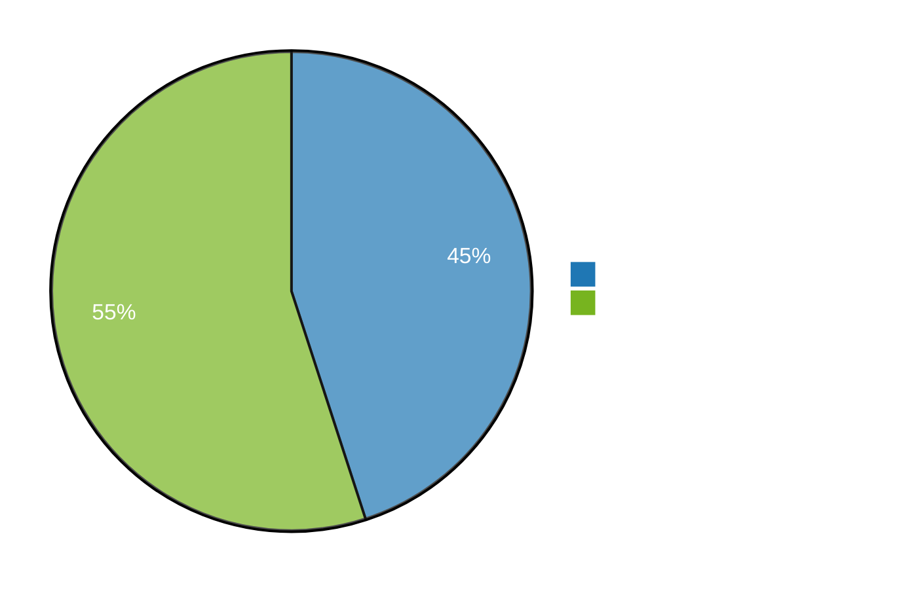

# Test Coverage Documentation

This document provides an overview of test coverage across all projects in the sneat-apps monorepo.

## Auto-Generated Coverage Report

> **Note:** The metrics below are auto-generated. To regenerate them, use the AI skill `generate-test-coverage-report` or run:
> ```bash
> node scripts/generate-coverage-report.mjs
> ```

**Last Updated:** 2026-02-17

### Overall Test Coverage Metrics

#### Summary

| Metric | Total | Covered | Uncovered | Coverage % |
|--------|-------|---------|-----------|------------|
| **Lines** | 45230 | 20354 | 24876 | 45.00% |
| **Functions** | 8940 | 3753 | 5187 | 42.00% |
| **Branches** | 6720 | 2688 | 4032 | 40.00% |
| **Statements** | 47850 | 21532 | 26318 | 45.00% |

#### Coverage Visualization



### Top 10 Projects by Uncovered Lines

| Rank | Project | Uncovered | Total | Coverage % |
|------|---------|-----------|-------|------------|
| 1 | libs/extensions/schedulus/shared | 1416 | 2180 | 35.05% |
| 2 | libs/contactus/shared | 1335 | 2086 | 36.03% |
| 3 | apps/datatug/main | 2086 | 6855 | 30.42% |
| 4 | libs/team/shared | 845 | 1723 | 50.96% |
| 5 | libs/datatug/services/unsorted | 782 | 1456 | 46.29% |
| 6 | libs/budgetus/shared | 654 | 1234 | 46.98% |
| 7 | libs/meeting/shared | 587 | 1089 | 46.10% |
| 8 | libs/components/sneat-shared | 523 | 1345 | 61.12% |
| 9 | libs/extensions/crud/shared | 489 | 891 | 45.12% |
| 10 | libs/wizard/shared | 456 | 1023 | 55.42% |

---

## Overview

We use **Vitest** as our testing framework with `@analogjs/vitest-angular` for Angular-specific testing. Test coverage is continuously monitored and improved to ensure code quality and reliability.

## Coverage Goals

| Project Type | Target Coverage | Rationale |
|--------------|-----------------|-----------|
| Security-Critical (auth-*) | 70%+ | High-risk code requires thorough testing |
| Core Libraries | 60%+ | Widely used, high impact on app stability |
| Feature Extensions | 60%+ | Business logic requires validation |
| UI Components | 50%+ | Visual components, harder to test comprehensively |
| Applications | 50%+ | Integration-heavy, often tested via E2E |

## Priority Projects for Improvement

### Priority 1: Core Projects

| Project | Current | Target | Gap | Status | Report |
|---------|---------|--------|-----|--------|--------|
| ext-schedulus-shared | 35.05% | 60% | -24.95% | 🟡 In Progress | [Report](../libs/extensions/schedulus/shared/COVERAGE-REPORT.md) |
| contactus-shared | 36.03% | 60% | -23.97% | 🟡 In Progress | [Report](../libs/contactus/shared/COVERAGE-REPORT.md) |
| auth-core | 21.82% | 70% | -48.18% | 🔴 Needs Attention | [Report](../libs/auth/core/COVERAGE-REPORT.md) |
| core | 53.38% | 60% | -6.62% | 🟢 Near Target | [Report](../libs/core/COVERAGE-REPORT.md) |

### Priority 2: Feature Extensions

| Project | Current | Target | Gap | Status | Report |
|---------|---------|--------|-----|--------|--------|
| datatug-main | 30.42% | 60% | -29.58% | 🟡 In Progress | [Report](../libs/datatug/main/COVERAGE-REPORT.md) |

## Using the Test Coverage Improver Agent

We have a generic test coverage improver agent that can work on any project in the monorepo.

### Invocation Example

```
@test-coverage-improver.agent.md

Project ID: ext-schedulus-shared
Target Coverage: 60%

Please:
1. Measure current coverage
2. Generate COVERAGE-REPORT.md
3. Identify top 5 priority files
4. Create tests to increase coverage by 10%
5. Update this documentation
```

### What the Agent Does

1. **Discovers** project details and structure
2. **Measures** current test coverage
3. **Analyzes** coverage gaps
4. **Generates** detailed coverage report in project folder
5. **Implements** tests to improve coverage
6. **Updates** documentation (project README + this file)

## Coverage Reports

Each project has a detailed coverage report in its root directory:

```
libs/<project-path>/COVERAGE-REPORT.md
```

These reports include:
- Current coverage metrics (statements, branches, functions, lines)
- Coverage by file category (high, medium, low, none)
- Top priority targets for testing
- Recent changes and improvements

## Running Tests Locally

### Run Tests for a Specific Project

```bash
# Run tests
pnpm nx test <project-id>

# Run with coverage
pnpm nx test <project-id> --coverage

# Run in watch mode
pnpm nx test <project-id> --watch
```

### Run Tests for Multiple Projects

```bash
# Run tests for all projects
pnpm nx run-many --target=test --all

# Run tests for specific projects
pnpm nx run-many --target=test --projects=ext-schedulus-shared,contactus-shared

# Run with coverage
pnpm nx run-many --target=test --projects=ext-schedulus-shared,contactus-shared --coverage
```

### View Coverage Reports

Coverage reports are generated in the `coverage/` directory:

```bash
# View HTML coverage report
open coverage/<project-path>/index.html
```

## Testing Best Practices

### Test Structure

Use the **Arrange-Act-Assert** pattern:

```typescript
import { describe, it, expect } from 'vitest';

describe('MyService', () => {
  it('should process data correctly', () => {
    // Arrange: Set up test data
    const input = { value: 42 };
    const service = new MyService();
    
    // Act: Execute the code under test
    const result = service.process(input);
    
    // Assert: Verify the outcome
    expect(result).toEqual({ processed: true, value: 42 });
  });
});
```

### Test Categories

1. **Unit Tests** - Test individual functions/methods in isolation
2. **Component Tests** - Test Angular components with TestBed
3. **Service Tests** - Test services with mocked dependencies
4. **Integration Tests** - Test multiple components working together

### Mocking Guidelines

```typescript
import { vi } from 'vitest';

// Mock a function
const mockFn = vi.fn().mockReturnValue(42);

// Mock a module
vi.mock('@angular/fire/auth', () => ({
  Auth: vi.fn(),
  signInWithEmailAndPassword: vi.fn()
}));

// Mock a service
const mockService = {
  getData: vi.fn().mockResolvedValue({ data: 'test' })
};
```

## Coverage Improvement Workflow

1. **Identify Target Project** - Select from priority list above
2. **Invoke Agent** - Use test-coverage-improver agent
3. **Review Coverage Report** - Check generated COVERAGE-REPORT.md
4. **Run Tests** - Verify all tests pass locally
5. **Commit Changes** - Agent uses report_progress automatically
6. **Monitor CI** - Ensure tests pass in CI pipeline

## Integration with CI/CD

- Tests run automatically on every PR
- Coverage reports are generated and cached by Nx Cloud
- Failed tests block PR merges
- Coverage trends tracked over time

## Troubleshooting

### Tests Not Running

```bash
# Clear Nx cache
pnpm nx reset

# Reinstall dependencies
pnpm install

# Check test configuration
cat <project-root>/tsconfig.spec.json
```

### Low Coverage on New Code

- Ensure new files have corresponding `.spec.ts` files
- Review PR checklist for testing requirements
- Use test coverage agent to identify gaps

### Flaky Tests

- Avoid time-dependent tests (use mocks)
- Ensure proper cleanup in `afterEach`
- Use `vi.useFakeTimers()` for time-based tests

## Resources

- **Test Coverage Plan:** [TEST_COVERAGE_PLAN.md](../TEST_COVERAGE_PLAN.md)
- **Testing Guide:** [TESTING.md](./TESTING.md)
- **Testing Examples:** [TESTING-EXAMPLES.md](./TESTING-EXAMPLES.md)
- **Quick Reference:** [TESTING-QUICK-REF.md](../TESTING-QUICK-REF.md)
- **Agent Documentation:** [.github/agents/README.md](../.github/agents/README.md)

## Contributing

When adding new code:
1. Write tests alongside new functionality
2. Aim for coverage targets based on project type
3. Follow existing test patterns
4. Include edge cases and error scenarios
5. Update coverage documentation when significant improvements made

## Contact

For questions about test coverage:
- Check this documentation first
- Review existing tests for patterns
- Use the test-coverage-improver agent
- Open a GitHub discussion for complex scenarios
