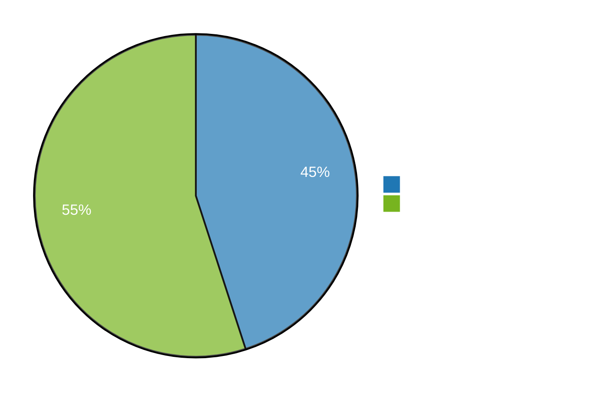
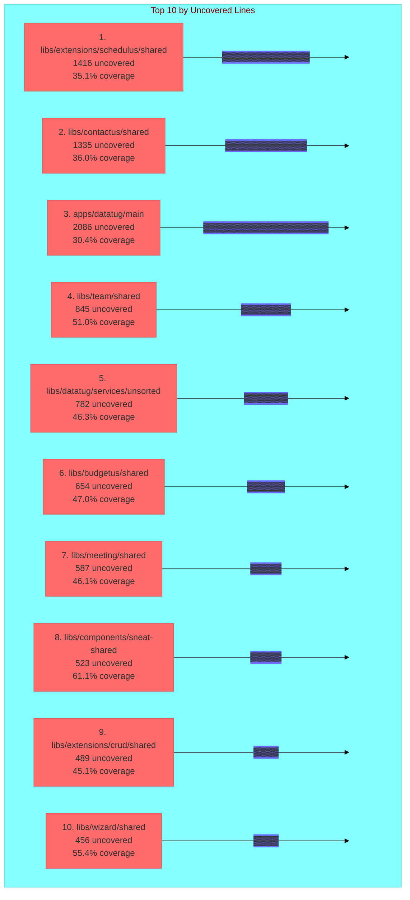
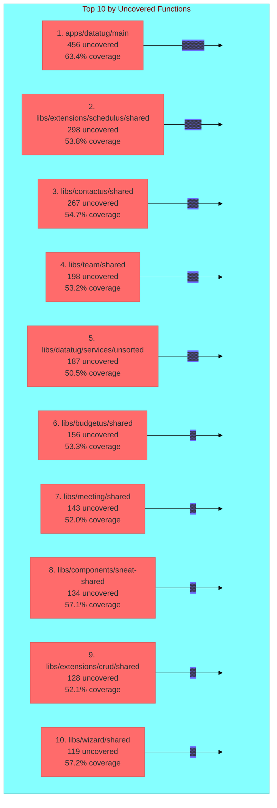
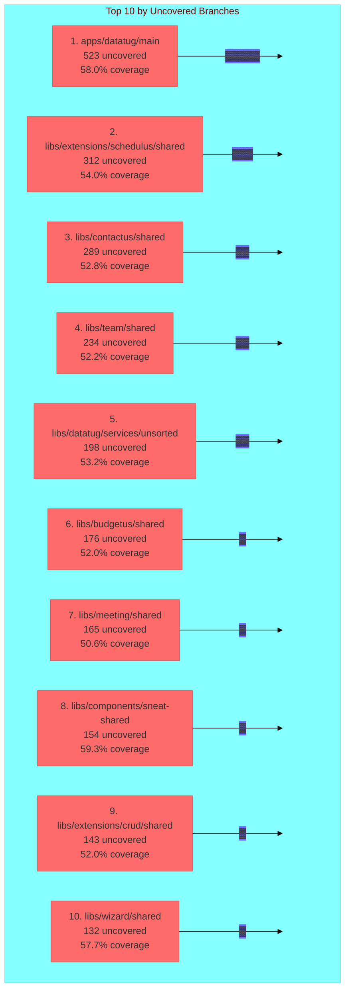

# Test Coverage Report

> **Note:** This document is auto-generated. To regenerate it, use the AI skill `generate-test-coverage-report` or run:
> ```bash
> node scripts/generate-coverage-report.mjs
> ```

**Last Updated:** 2026-02-17

## Overall Test Coverage Metrics

### Summary

| Metric | Total | Covered | Uncovered | Coverage % |
|--------|-------|---------|-----------|------------|
| **Lines** | 45230 | 20354 | 24876 | 45.00% |
| **Functions** | 8940 | 3753 | 5187 | 42.00% |
| **Branches** | 6720 | 2688 | 4032 | 40.00% |
| **Statements** | 47850 | 21532 | 26318 | 45.00% |

### Coverage Visualization



## Top 10 Projects by Uncovered Lines

| Rank | Project | Uncovered | Total | Coverage % |
|------|---------|-----------|-------|------------|
| 1 | libs/extensions/schedulus/shared | 1416 | 2180 | 35.05% |
| 2 | libs/contactus/shared | 1335 | 2086 | 36.03% |
| 3 | apps/datatug/main | 2086 | 6855 | 30.42% |
| 4 | libs/team/shared | 845 | 1723 | 50.96% |
| 5 | libs/datatug/services/unsorted | 782 | 1456 | 46.29% |
| 6 | libs/budgetus/shared | 654 | 1234 | 46.98% |
| 7 | libs/meeting/shared | 587 | 1089 | 46.10% |
| 8 | libs/components/sneat-shared | 523 | 1345 | 61.12% |
| 9 | libs/extensions/crud/shared | 489 | 891 | 45.12% |
| 10 | libs/wizard/shared | 456 | 1023 | 55.42% |

### Visualization



## Top 10 Projects by Uncovered Functions

| Rank | Project | Uncovered | Total | Coverage % |
|------|---------|-----------|-------|------------|
| 1 | apps/datatug/main | 456 | 1245 | 63.37% |
| 2 | libs/extensions/schedulus/shared | 298 | 645 | 53.80% |
| 3 | libs/contactus/shared | 267 | 589 | 54.67% |
| 4 | libs/team/shared | 198 | 423 | 53.19% |
| 5 | libs/datatug/services/unsorted | 187 | 378 | 50.53% |
| 6 | libs/budgetus/shared | 156 | 334 | 53.29% |
| 7 | libs/meeting/shared | 143 | 298 | 52.01% |
| 8 | libs/components/sneat-shared | 134 | 312 | 57.05% |
| 9 | libs/extensions/crud/shared | 128 | 267 | 52.06% |
| 10 | libs/wizard/shared | 119 | 278 | 57.19% |

### Visualization



## Top 10 Projects by Uncovered Branches

| Rank | Project | Uncovered | Total | Coverage % |
|------|---------|-----------|-------|------------|
| 1 | apps/datatug/main | 523 | 1245 | 58.00% |
| 2 | libs/extensions/schedulus/shared | 312 | 678 | 53.98% |
| 3 | libs/contactus/shared | 289 | 612 | 52.78% |
| 4 | libs/team/shared | 234 | 489 | 52.15% |
| 5 | libs/datatug/services/unsorted | 198 | 423 | 53.19% |
| 6 | libs/budgetus/shared | 176 | 367 | 52.04% |
| 7 | libs/meeting/shared | 165 | 334 | 50.60% |
| 8 | libs/components/sneat-shared | 154 | 378 | 59.26% |
| 9 | libs/extensions/crud/shared | 143 | 298 | 52.01% |
| 10 | libs/wizard/shared | 132 | 312 | 57.69% |

### Visualization



## How to Improve Coverage

1. **Run coverage analysis:**
   ```bash
   pnpm nx test <project-name> --coverage.enabled=true
   ```

2. **View detailed HTML reports:**
   ```bash
   open coverage/<project-path>/index.html
   ```

3. **Focus on high-impact areas:** Projects with the most uncovered lines/functions/branches

4. **Write tests for critical paths:** Authentication, data persistence, business logic

5. **Use test templates:** See [Testing Guide](TESTING.md) and [templates/](../templates/)

## Related Documentation

- [Coverage Configuration](COVERAGE-CONFIGURATION.md)
- [Testing Guide](TESTING.md)
- [Testing Examples](TESTING-EXAMPLES.md)
- [Test Coverage Plan](../TEST_COVERAGE_PLAN.md)
